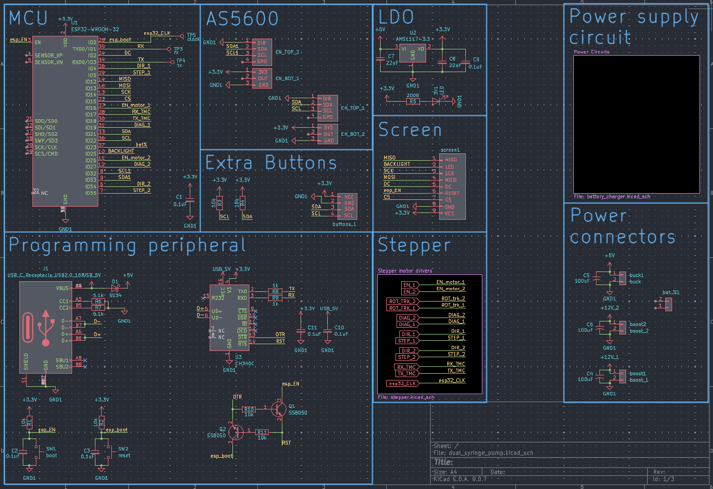
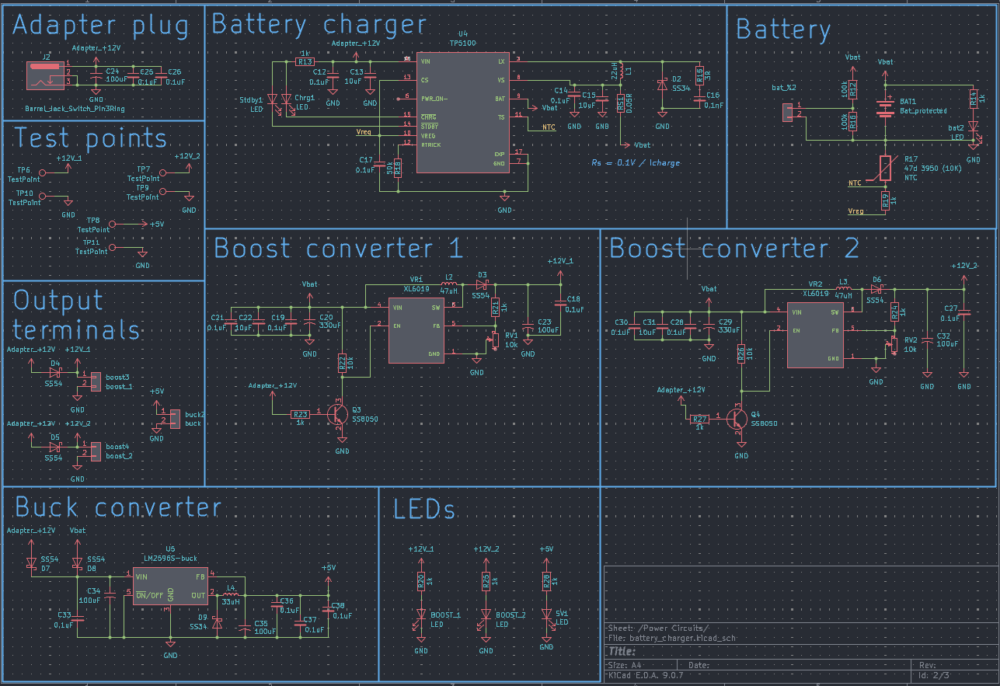
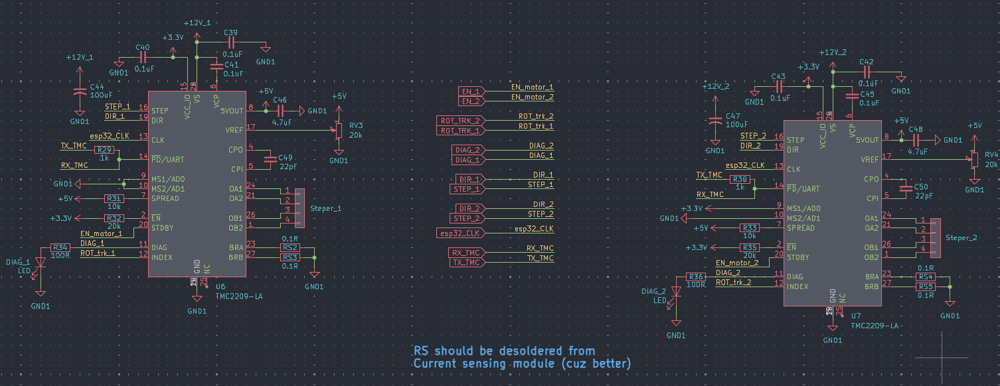

# Dual Syringe Pump Controller (ESP32 + TMC2209)

This repository contains the KiCad hardware design for a compact, battery-powered dual stepper motor controller. Designed around the **ESP32-WROOM-32** for wireless control and **TMC2209** silent stepper drivers, this board is optimized for high-precision multi-channel micropump systems and drug delivery applications.

## 🛠 Hardware Architecture

The project is divided into three main functional blocks:

### 1. Power Management & Charging
A robust power subsystem designed to handle both wall power and battery operation, ensuring uninterrupted dispensing.
* **Charging:** Integrated **TP5100** battery charger for 2S Li-ion setups.
* **Regulation:** * **Buck Converter (LM2596):** Stepping down input voltage to 5V for logic.
    * **LDO (AMS1117-3.3):** Providing stable 3.3V for the ESP32 and sensors.
    * **Dual Boost Converters (XL6009):** Independent 12V rails (`+12V_1` and `+12V_2`) to power the stepper drivers, allowing for high-torque performance even on battery power.

### 2. Main Control & Interface
The logic center of the board, featuring:
* **MCU:** ESP32-WROOM-32 with USB-C programming via **CH340C** and an auto-reset circuit.
* **Position Feedback:** Support for dual **AS5600** magnetic encoders via I2C for closed-loop monitoring and exact position tracking.
* **User Interface:** Headers for an external screen, status LEDs, and additional tactile buttons.

### 3. Stepper Driver Stage
High-performance motor control featuring:
* **Drivers:** Dual **TMC2209-LA** drivers (U6 & U7).
* **Communication:** UART interface mapped to the ESP32 for advanced configuration (StealthChop, StallGuard, dynamic current limits).
* **Optimization:** Support for hardware-level current sensing. *(Note: RS resistors should be desoldered from the current sensing module for better performance, as noted in the schematic).*

---

## 📋 Key Specifications

| Component | Specification |
| :--- | :--- |
| **Microcontroller** | ESP32-WROOM-32 (Wi-Fi/BT) |
| **Stepper Drivers** | 2x TMC2209 (SilentStepStick style) |
| **Input Voltage** | +12V Adapter or 2S Li-ion Battery |
| **Logic Voltage** | 3.3V and 5V |
| **Sensors** | 2x AS5600 Magnetic Encoders |
| **USB Interface** | USB-C (CH340C) |

---

## 📂 PCB layout

---

## 📝 Design Notes

* **Current Sensing:** Ensure you desolder the RS resistors from the driver modules if you are using an external current sensing setup to avoid interference.
* **Thermal Management:** Provide adequate cooling (heatsinks/airflow) for the XL6009 boost converters and TMC2209 drivers if running the stepper motors at high continuous currents.
* **Big thanks to google gemini for writting this for me :D
